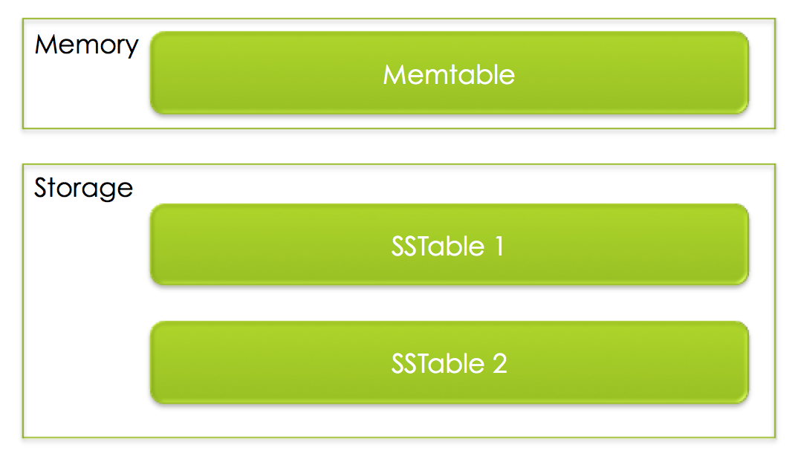

# [Design Pattern](https://www.journaldev.com/1827/java-design-patterns-example-tutorial)

## [Singleton Pattern](https://www.javaworld.com/article/2073352/core-java/simply-singleton.html)

### Intent

Ensure a class has only one instance, and provide a global point of access to it.

Encapsulated "just-in-time initialization" or "initialization on first use".

### Problem

Application needs one, and only one, instance of an object. Additionally, lazy initialization and global access are necessary.

### Example

[Source code](design_pattern_ex/SingletonExample.md)

[More example about thread safe, block, serial with singleton](https://www.journaldev.com/1377/java-singleton-design-pattern-best-practices-examples)


## Factory Pattern

### Intent
Define an interface for creating an object, but let subclasses decide which class to instantiate. Factory Method lets a class defer instantiation to subclasses.

Defining a "virtual" constructor.

The new operator considered harmful.????

### Problem

A framework needs to standardize the architectural model for a range of applications, but allow for individual applications to define their own domain objects and provide for their instantiation.

### Example

[Source code](design_pattern_ex/Factory.md)

## [Builder Pattern](https://sourcemaking.com/design_patterns/builder)

### Intent
Separate the construction of a complex object from its representation so that the same construction process can create different representations.

Parse a complex representation, create one of several targets.

### Problem

An application needs to create the elements of a complex aggregate. The specification for the aggregate exists on secondary storage and one of many representations needs to be built in primary storage.

### Example

## Adapter Pattern

### Intent

Convert the interface of a class into another interface clients expect. Adapter lets classes work together that couldn't otherwise because of incompatible interfaces.

Wrap an existing class with a new interface.
Impedance match an old component to a new system

### Problem

An "off the shelf" component offers compelling functionality that you would like to reuse, but its "view of the world" is not compatible with the philosophy and architecture of the system currently being developed.

### Example

[Source code](design_pattern_ex/Adapter.md)

## Dependency injection pattern

### Intent

The pattern separates the creation of a client's dependencies from its own behavior, which allows program designs to be loosely coupled and to follow the inversion of control and single responsibility principles.

### Problems

You need to remove knowledge of concrete implementation from object

Enable unit testing of classes in isolation using mock objects or stubs

You need your application flexible and easy to extend

### Example

[Source code](design_pattern_ex/Dependency_injection.md)

### References
[1](https://viblo.asia/p/java-dependency-injection-di-design-pattern-example-tutorial-oOVlYyyyl8W)
[2](https://www.journaldev.com/2394/java-dependency-injection-design-pattern-example-tutorial)

# Clean code

## What is clean code?

There are some ideas that are considered best practice and what constitutes as clean code within the industry and community, but there is no definitive distinction. After reading few topics:

> Clean code is code that is easy to understand and easy to change.

Specifically: Easy to understand means the code is easy to read, minimizes the need for guesswork and possibility for misunderstandings. Easy to change means the code is easy to extend and refactor, and it’s easy to fix bugs in the codebase.

## [Ways to Write Cleaner Code](https://www.butterfly.com.au/blog/website-development/clean-high-quality-code-a-guide-on-how-to-become-a-better-programmer)

1. Variable and method name

        Use naming convention
        Use intention-revealing name
        Use pronounceable name
        Use namespaces instead of prefixing names
        Use one word per concept
        Use one word per concept
        Use verbs for function names and nouns for classes and attributes
1.  Better Functions

        The smaller the better
        A function should only do one thing
        No nested control structure 
        Less arguments are better
        No side effects(Functions must only do what the name suggests and nothing else.)
        Avoid output arguments
        Don’t repeat yourself(Functions must be atomic)
1. Comments

        Don’t comment bad code, rewrite it
        If code is readable you don’t need comments
        Explain your intention in comments
        Warn of consequences in comments
        Emphasis important points in comments
        Use @document comment if possiple
        Noise comments are bad
        Never leave code commented

1. Whitespace Is Nice Space
1. Using design pattern as possible as we can
## Quote

1. `Code is like humor. When you **have** to explain it, it’s bad`

1. `If you want your code to be easy to write, make it easy to read — Robert C. Martin`

1. `Programming is the art of telling another human what one wants the computer to do.— Donald Knuth`

# [Log-structured merge-tree (LSM)](https://www.slideshare.net/ConfluentInc/power-of-the-loglsm-append-only-data-structures)

<!-- ## [Application](http://www.benstopford.com/2015/02/14/log-structured-merge-trees/) -->

## [What is LSM?](https://blog.acolyer.org/2014/11/26/the-log-structured-merge-tree-lsm-tree/)
LSM : 
- Provide low-cost indexing for a file experiencing a high rate of record inserts.
- The LSM-tree is most useful in applications where index inserts are more common than finds that retrieve the entries. 
- An LSM-tree is composed of two or more tree-like component data structures.
- The index entry for [an insert] is inserted into the memory resident C0 tree, after which it will in time migrate out to the C1 tree on disk; any search for an index entry will look first in C0 and then in C1.
- The C0 tree as a result of an insert reaches a threshold size near the maximum allotted, an ongoing rolling merge process serves to delete some contiguous segment of entries from the C0 tree and merge it into the C1 tree on disk.
## [LSM with RocksDB](https://www.slideshare.net/meeeejin/rocksdb-detail)
In the simplified RocksDB, there are [2 major components](https://medium.com/rocksdb-internals-a-beginners-guide/how-to-sound-like-you-know-rocksdb-1-a194db9e5070):

- Memtable: a buffer that can temporarily host the incoming writes; memtable are normally sorted (in RocksDB, the default memtable implementation is [SkipList](https://www.geeksforgeeks.org/skip-list/)), but that is not required.

- SSTable: once a memtable reached a certain size, it will flush to the storage (to make it simple, let’s assume we are talking disk) and generates a SSTable (sorted static table), which is immutable in its life time.

To make sure data written to memtable is safe from process or server crash, we often enable the transaction log, which is essentially a redo log.

A background thread that periodically do the “compaction”: merging these SSTables to a bigger SSTable.


# Data structure in RocksDB (except LSM)
<!-- [Rocksdb](https://www.slideshare.net/meeeejin/rocksdb-detail) -->
<!-- https://www.slideshare.net/HiveData/tech-talk-rocksdb-slides-by-dhruba-borthakur-haobo-xu-of-facebook -->

[Bloom filter](https://github.com/facebook/rocksdb/wiki/RocksDB-Bloom-Filter): In RocksDB, every SST file contains a Bloom filter, which is used to determine if the file may contain the key we're looking for.

# Probabilistic algorithms

## Characteristics

Ignore collisions but errors are controlled under a certain specified threshold

They trade in a small margin of error for considerably less memory footprint and constant query time

## Specialization

### [Bloom Filter](http://llimllib.github.io/bloomfilter-tutorial/)

1. How it work

    The bloom filter essentially consists of a **bit vector** of length m, represented by the central column.

    To add an item to the bloom filter, we feed it to k different hash functions and set the bits at the resulting positions. Note that sometimes the hash functions produce overlapping positions, so less than k positions may be set.

    To test if an item is in the filter, again we feed it to the k hash functions. This time, we check to see if any of the bits at these positions are not set. If any are not set, it means the item is definitely not in the set. Otherwise, it is probably in the set.

2. [Example](https://www.jasondavies.com/bloomfilter/)

### Cuckoo Filters

1. How it work

    ```
    Parameters of the Filter:
    1. Two Hash Functions: h1 and h2
    2. An array B with n buckets. The i-th bucket will be called B[i]

    Input: L, a list of elements to be inserted into the cuckoo filter.

    Algorithm:
    While L is not empty:
        Let x be the first item in the list L. Remove x from the list.
        If B[h1(x)] is empty:
            place x in B[h1(x)]
        Else, If B[h2(x) is empty]:
            place x in B[h2(x)]
        Else:
            Let y be the element in B[h2(x)].
            Prepend y to L
            place x in B[h2(x)]
    ```
1. [Example](http://www.lkozma.net/cuckoo_hashing_visualization/) 

### Count Min Sketch

1. How it work
    
    Use multiple arrays with different hash functions to compute the index.
    
    When queried, return the minimum of the numbers the arrays. → Count-Min Sketch
1. [Example](http://hkorte.github.io/slides/cmsketch/#/7)

### HyperLogLog

1. [How it work](https://www.slideshare.net/gakhov/probabilistic-data-structures-part-2-cardinality)
      
    Stochastic averaging is used to reduce the large variability:

    - The input stream of data elements S is divided into m substreams S(i) using the first p bits of the hash values (m = 2^p)
    - In each substream, the rank (after the initial p bits that are used for substreaming) is measured independently.
    - These numbers are kept in an array of registers M, where M[i] stores the maximum rank it seen for the substream with index i.
    
    The cardinality formula is calculated computes to approximate the cardinality of a multiset.

1. [Example](https://www.slideshare.net/gakhov/probabilistic-data-structures-part-2-cardinality)

# [Trie](https://www.slideshare.net/charmichokshi/dictionary-implementation-using-trie-77672370)
Real World Application of TRIE :
- Auto complete in web searching
- Spell checker (Auto correct)
- Word game
- Dictionary
- Longest prefix matching
- Translator
- Criminology
- Phone book search

# [Cryptographic and Non-Cryptographic Hash Functions](https://dadario.com.br/cryptographic-and-non-cryptographic-hash-functions/)

The [main difference](https://www.quora.com/What-is-the-difference-between-cryptographic-and-noncryptographic-hashes) between cryptographic hashes and non cryptographic hashes is “uniqueness”. 
Time to hash with cryptographic is longer than non-crytographic.

## Benmark

### Pre-requirement

1. `xxhash`: install by command

```sh
pip install xxhash
``` 
### Run and config

Using:
- Arg1 : file hash
- Arg2 : time to hash

Example: `python benmark.py 419788.jpg`

=> Output: 

```sh
Data is hashed : 2046 times with xxhash
Data is hashed : 232 times with md5
```


# Hash Tables

## Idea

This hash function has two steps:
1. Convert the string to a large integer
```python
# "a" should be a prime number larger than the size of the alphabet
for i = 0, 1, ..., string_len:
    hash += (a ** (string_len - (i+1))) * char_code(string[i])
```

2. Reduce the size of the integer to a fixed range by taking its remainder mod m
```python
hash = hash % num_buckets
```

They use hash table to handle collisions using a technique called open addressing with double hashing.

```
index = (hash_a(string) + i * (hash_b(string) + 1)) % num_buckets
```

They increase the size of the item array when it gets too full. To resize, we create a new hash table roughly half or twice as big as the current, and insert all non-deleted items into it.

## Implementation

[Repo](https://github.com/jamesroutley/write-a-hash-table) is builded in [hashhash_table_C](hash_table_C) and fix some bugs. Compile C code with Makefile.

JNI is implemented in [hash_table_JNI](hash_table_JNI). To compile JNI project, use `run.sh` script. With option:
- `1`: compile java code and create C header.
- `2`: compile C code and create lib for JNI.
- `3`: only run program.
- `4`: do all step above.